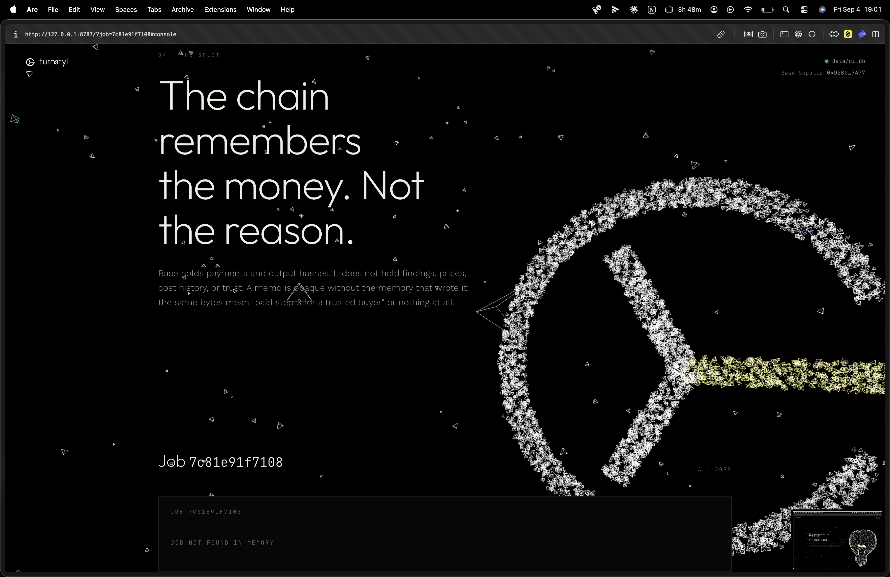
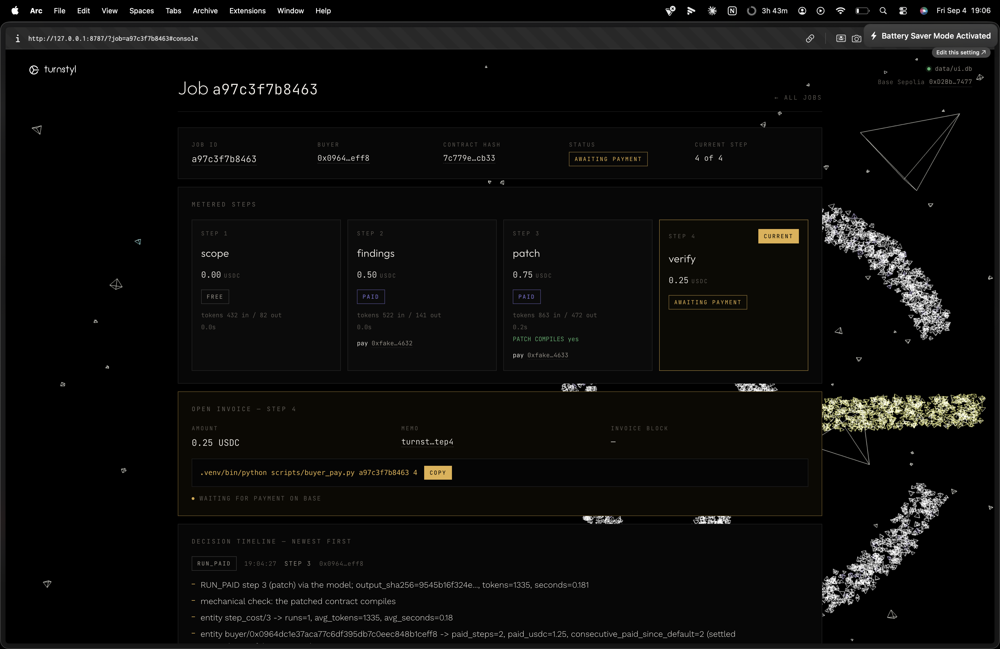

# turnstyl

turnstyl is a metered AI agent. It audits a Solidity contract in four steps, and
it gets paid per step in USDC on Base: step 1 (scope) is free, steps 2
(findings), 3 (patch) and 4 (verify) are sold individually. Job state, step
outputs, step costs, and a per-buyer ledger live in Sibyl Memory, and every
decision the agent makes, what to charge, whether to run, whether to extend
credit, whether to refuse, is a function of what it reads there and is written
back as a journal entry naming the facts it used.

## The delete test

Delete `data/turnstyl.db` and the agent forgets it was ever paid: it invoices the
same buyer again for work already delivered and settled. In the live demo the
buyer then pays that second invoice, and it lands on Base Sepolia right next to
the first one: [`0x1f7656c5d27809d4…`](https://sepolia.basescan.org/tx/0x1f7656c5d27809d49477f27a6e6eb62362eec80738fdebc1c9d3797111626f0c). Both
payments are on chain; only the agent's memory of the first is gone.

## What memory changes

| Decision | Memory fact it reads | What changes |
| --- | --- | --- |
| resume | `job:<id>` state and `job/<id>` entity | picks up at the recorded step; a step with output is never re-run or re-charged |
| price | `findings/<hash>` and `step_cost/<n>` | 0.50 becomes 0.25 when the output is already stored; 1.5x when recorded avg_tokens > 6000 |
| credit | `buyer/<addr>` completed_paid_jobs, open_invoices, defaults | RUN_ON_CREDIT instead of WAIT_FOR_PAYMENT for a buyer with three fully paid jobs |
| refuse | `buyer/<addr>` unpaid_from_prior_jobs | REFUSE paid work from a buyer who left a closed job unpaid |
| cache | `findings/<hash>` | a repeat contract is served from the store with no model call at all |

## Memory tiers used

| Tier | Key or entity | Holds |
| --- | --- | --- |
| HOT state | `job:<job_id>` | current step, status, open invoice, buyer, contract hash |
| HOT state | `active_jobs` | job ids not yet complete, so a fresh process can find them |
| HOT state | `fake_payments` | settled invoices, offline backend only |
| WARM entity | `buyer/<address>` | paid steps, USDC paid, outstanding invoices, defaults, earn-back counter, trust tier |
| WARM entity | `job/<job_id>` | per step: output, sha256, price, tokens, seconds, commit tx, compile verdict |
| WARM entity | `step_cost/<n>` | rolling average tokens and seconds per step, which feeds pricing |
| WARM entity | `findings/<contract_hash>` | the four step outputs, keyed by contract hash |
| COLD journal | one event per decision | what memory said, what the agent did, what it expects next |
| REFERENCE | `pricing_rules` | base prices and multipliers, written once on first run |
| REFERENCE | `contract:<hash>` | the contract source, so a resumed job needs no file path |
| ARCHIVE | `job/<job_id>` on completion | closed jobs move out of the active set, outputs copied to `findings/` first |
| FTS5 | `search_entities` over `findings/*` | on `job new`, queried with the contract's function names for a "memory hint" |

## Policy rules

Base prices in USDC: step 1 0.00, step 2 0.50, step 3 0.75, step 4 0.25.

- half price when this contract's output for that step is already in `findings/`
- 1.5x when the recorded average token cost for that step exceeds 6000
- **RUN_FREE**: step 1, never gated
- **RUN_PAID**: the invoice for this step is settled
- **RUN_ON_CREDIT**: unpaid, but the buyer is trusted
- **WAIT_FOR_PAYMENT**: unpaid and credit not earned
- **REFUSE**: the buyer left work unpaid when a previous job closed

Trust tiers: **trusted** needs three completed jobs with every paid step settled
(`completed_paid_jobs >= 3`), nothing outstanding, and either no default or an
earned-back one. **blocked** at two defaults. Otherwise **new**. Step counts do
not earn credit: a buyer who pays two steps and walks away from the third has
paid for nothing the agent can extend credit on. Repeat contracts are served
from memory at half price, so a history of three paid jobs is cheap to build.

A default is one delivered-but-unpaid step at the moment a job closes. It stays
on the record permanently. Paying the debt clears `unpaid_from_prior_jobs` and
lifts the refusal, but not the credit: the buyer pays up front until four
consecutive settled steps have gone by, at which point credit returns. A second
default cannot be worked off.

## On chain

`contracts/src/TurnstylReceipts.sol`, Base Sepolia (chain 84532):

**`0xD2Bb3c9741D7c26A8B161895bb91471706B17477`**
<https://sepolia.basescan.org/address/0xD2Bb3c9741D7c26A8B161895bb91471706B17477>

- `pay(bytes32 memo, uint256 amount)` moves USDC from the buyer to the agent in
  one call and emits `Paid`.
- `commit(bytes32 memo, bytes32 outputHash)` publishes the sha256 of a delivered
  step and emits `Committed`. Agent only.
- The contract holds no custody, it never takes a token balance, and it has no
  owner, no pause and no upgrade path.

Every job page has **Verify**: for each step, the API fetches the commit
transaction's receipt, decodes `Committed(memo, outputHash)`, recomputes the
sha256 of the output in memory and compares. A match proves the output the
buyer received is the one committed at payment time. It needs both sides: the
chain holds the hash and memory holds the output; either alone proves nothing.
**Download report** exports the whole audit as Markdown with every hash and
transaction link, so the check can be repeated by hand on BaseScan.

The memo is `keccak256("<job_id>:<step>")`, a bare string anyone can recompute. A
payment counts when a `Paid` log carries that memo, a payer matching the invoiced
buyer, and at least the invoiced amount. The agent trusts the log, not the buyer.

## Mechanical gates on model output

- The patch step returns a whole patched file. turnstyl produces the unified diff
  itself with `difflib`, so the diff applies by construction and the model never
  writes a hunk header.
- That file is compiled in a throwaway Foundry project with `forge build`. If it
  fails, the compiler errors go back to the model once. The verdict is recorded
  and shown as `PATCH COMPILES: yes/no`.
- The verifier step is handed those results as `MECHANICAL CHECKS` and is
  instructed that nothing may be marked CLOSED if the patch does not compile.

## Run it

Offline, no API key, no chain, no spend:

```bash
.venv/bin/python scripts/demo_offline.py        # eight-beat acceptance test

export MOCK_LLM=1 PAYMENTS=fake
.venv/bin/turnstyl job new examples/Vault.sol --buyer 0xYourAddress
.venv/bin/turnstyl pay <job_id> 2
.venv/bin/turnstyl job run <job_id>
.venv/bin/turnstyl ledger 0xYourAddress
.venv/bin/turnstyl status
```

Live on Base Sepolia. `.env` (gitignored, never printed) must define
`BASE_SEPOLIA_RPC`, `USDC_ADDRESS`, `RECEIPTS_ADDRESS`, `RECEIPTS_DEPLOY_BLOCK`,
`AGENT_ADDRESS`, `AGENT_PRIVATE_KEY`, `BUYER_ADDRESS`, `BUYER_PRIVATE_KEY`:

```bash
scripts/demo_live.sh                            # nine beats, real USDC
# honours TURNSTYL_DB; defaults to ./data/demo_live.db
```

A real audit against the Anthropic API needs `ANTHROPIC_API_KEY` in `.env`:

```bash
export PAYMENTS=fake LLM_MODEL=claude-haiku-4-5 TURNSTYL_DB=./data/real_run.db
unset MOCK_LLM
.venv/bin/turnstyl job new examples/Vault.sol --buyer 0xYourAddress
.venv/bin/turnstyl pay <job_id> 2 && .venv/bin/turnstyl job run <job_id>
```

Contracts: `cd contracts && forge test`. `forge init --no-git` vendored
`forge-std` as plain files, so a fresh clone builds with no `forge install`.

## Web UI

One page, served from the same process that reads the agent's memory: a scroll
story at the top and a live operator console at the bottom. It reads only from
Sibyl Memory through the read-only API; nothing on the page can write.

```bash
.venv/bin/turnstyl serve --db ./data/turnstyl.db     # then open http://127.0.0.1:8787
```

Scrolling drives a 5,000-particle scene that morphs through a scatter between
sections: brain (the hero), coin (every step is paid), bulb (restart it, it
remembers), scatter (the delete test), then the turnstyl mark for the last story
and the console. The console lists every job the store knows, and a job page
shows all four metered steps as cards, the open invoice, the decision timeline
and the buyer ledger. Delete the memory file while the page is open and it stays
up: the scene locks to a red scatter, the counters read "memory deleted", and
every panel says what was lost rather than showing a stale copy.






## Live

The page is always up on GitHub Pages at <https://shrooms08.github.io/turnstyl/>.
The agent behind it is live while the operator's machine is on: the API and the
worker run on that Mac, reached through a Cloudflare quick tunnel whose URL the
page reads from `config.js`. When the machine is off, the page still tells the
story and shows the brand; the console reads `agent offline: the operator's
machine is not reachable right now`, and submit and pay are held.

Two commands, from the repo on the operator's machine:

```bash
scripts/tunnel.sh          # go live: caffeinate, serve --with-worker, cloudflared, publish the URL
scripts/tunnel_check.sh    # from anywhere: is the published page pointing at a reachable agent?
```

`tunnel.sh` runs with `PAYMENTS=base` and the real model, writes the tunnel
URL into `web/config.js`, pushes only that file to `gh-pages`, and on Ctrl-C
stops everything and publishes an empty `config.js` again. The API allows the
Pages origin and localhost only, and takes at most `MAX_JOBS_PER_DAY` jobs
(default 150) per UTC day; `/api/status` reports `remaining_today`.
`scripts/pages.sh` republishes the whole page after a change to `web/`.

## Buyer side

The page is also where a buyer does business with the agent. Nothing here needs
a terminal.

- **Connect.** `Connect wallet` in the top bar asks the injected wallet (Rabby,
  MetaMask) for an account and switches it to Base Sepolia, adding the network
  if it is missing. Nothing is requested on page load; a reload reconnects
  silently only if this tab connected before. The bar shows the address and
  the wallet's USDC balance.
- **Submit.** The `new audit` panel takes pasted Solidity or a dropped `.sol`
  file. `Submit for scope (free)` posts it with the connected address; the
  agent runs scope at once and invoices step 2. Submitting the same contract
  again resumes the open job instead of starting another.
- **Pay.** The open invoice shows `Pay <amount> USDC` when the connected
  address is the job's buyer. It reads the USDC allowance, approves 100 USDC
  once if needed, then calls `pay(memo, amount)` on the receipts contract and
  waits for the receipt. The worker in the serving process runs the step the
  moment the payment lands; no manual `job run`.
- **Credit.** After three fully paid jobs the buyer is trusted and the next step
  runs before its invoice clears: the job shows `started on credit, invoice
  open`, and the amount is carried on the ledger until it is paid.
- **Your jobs.** With a wallet connected, the list filters to that address,
  and any job or ledger that belongs to it is marked `this is you`.
- **Without a wallet.** With `PAYMENTS=fake` the Pay button becomes `Simulate
  payment`, which calls `POST /api/jobs/{id}/pay` and marks the invoice settled
  the way `turnstyl pay` does, so the whole flow runs locally.

Serve with the worker so paid steps run themselves:

```bash
export PAYMENTS=fake MOCK_LLM=1                          # or PAYMENTS=base, MOCK_LLM unset
.venv/bin/turnstyl serve --with-worker --db ./data/turnstyl.db
```

## Sample audit

[docs/sample_audit.md](docs/sample_audit.md): a real four-step run against
`claude-haiku-4-5`, verbatim, with token counts, cost, and the mechanical
verdicts. Memory implementation note: [docs/MEMORY.md](docs/MEMORY.md).

Status: day 4: web UI, particle scene, brand.
